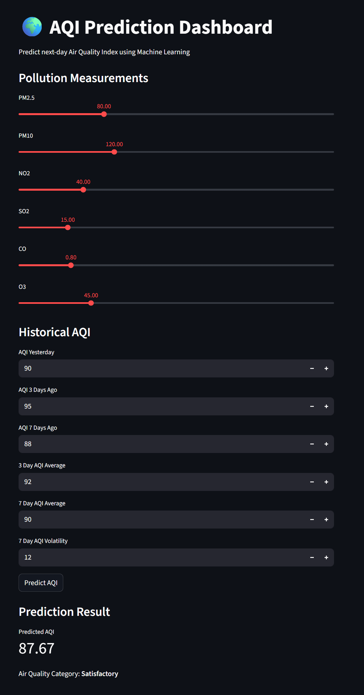
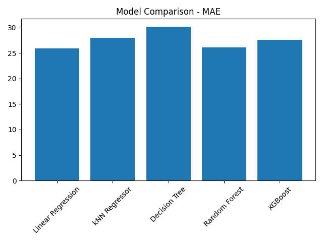
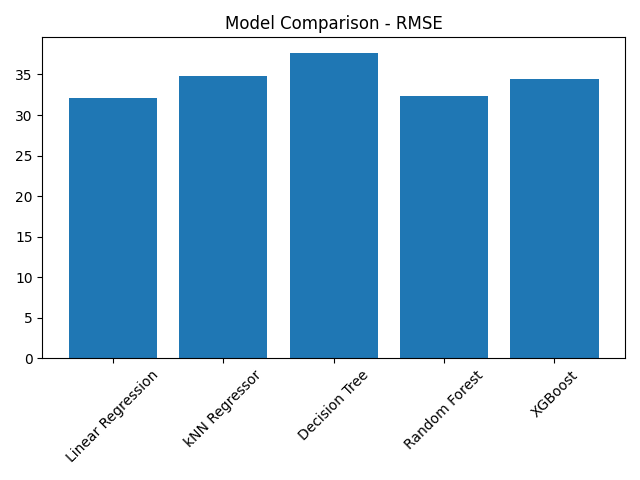

# 🌍 Air Quality Index Prediction System (Machine Learning)

A complete **Machine Learning system that predicts the next-day Air Quality Index (AQI)** for **Ahmedabad, India** using pollutant measurements and historical AQI trends.

This project follows a structured **ML engineering workflow**, including data preprocessing, feature engineering, model comparison, cross-validation, model serialization, and deployment using a **Streamlit dashboard**.

---

## Dashboard Preview



---

# 📌 Problem Statement

Air pollution is a major environmental and public health concern. Accurate prediction of the **Air Quality Index (AQI)** can help individuals and policymakers make informed decisions.

This project aims to build a **machine learning model capable of forecasting the next-day AQI** using historical pollutant measurements and AQI trends.

---

# 🎯 Project Objectives

* Predict **next-day AQI** using machine learning.
* Apply **time-series feature engineering**.
* Compare multiple ML models to identify the best performer.
* Evaluate models using **TimeSeriesSplit cross-validation**.
* Build an **interactive dashboard** for real-time predictions.

---

# 📊 Dataset

Dataset Source:
Kaggle — *Air Quality Data in India*

Dataset includes daily measurements for multiple pollutants:

| Feature | Description               |
| ------- | ------------------------- |
| PM2.5   | Fine particulate matter   |
| PM10    | Coarse particulate matter |
| NO₂     | Nitrogen dioxide          |
| SO₂     | Sulfur dioxide            |
| CO      | Carbon monoxide           |
| O₃      | Ozone                     |
| AQI     | Air Quality Index         |

For this project, data was filtered specifically for:

```
City: Ahmedabad
Time Range: 2015 – 2023
Total Records: ~3200 daily observations
```

---

# ⚙️ Machine Learning Pipeline

The project follows a modular ML workflow:

1️⃣ Data Loading -->
2️⃣ Data Filtering (Ahmedabad)-->
3️⃣ Time-Series Preparation-->
4️⃣ Feature Engineering-->
5️⃣ Model Training-->
6️⃣ Model Comparison-->
7️⃣ Cross-Validation-->
8️⃣ Model Serialization-->
9️⃣ Prediction Pipeline-->
🔟 Streamlit Deployment

---

# 🧠 Feature Engineering

To capture temporal patterns in AQI, the following **time-series features** were created.

### Lag Features

```
aqi_lag_1
aqi_lag_3
aqi_lag_7
```

These represent AQI values from previous days.

---

### Rolling Statistics

```
rolling_mean_3
rolling_mean_7
rolling_std_7
```

These capture **short-term trends and volatility** in AQI levels.

---

# 🤖 Models Evaluated

Multiple machine learning models were trained and evaluated.

| Model             | Description               |
| ----------------- | ------------------------- |
| Linear Regression | Baseline regression model |
| kNN Regressor     | Distance-based model      |
| Decision Tree     | Tree-based regression     |
| Random Forest     | Ensemble learning         |
| XGBoost           | Gradient boosting         |

Evaluation was performed using:

```
TimeSeriesSplit Cross-Validation
```

This prevents **data leakage in time-series prediction problems**.

---

# 📈 Model Performance

| Model             | MAE       |
| ----------------- | --------- |
| Linear Regression | 25.94     |
| Random Forest     | **26.14** |
| XGBoost           | 27.61     |
| kNN Regressor     | 28.01     |
| Decision Tree     | 30.19     |

Final model selected:

```
Random Forest Regressor
```

Average prediction error:

```
MAE ≈ 26 AQI points
```

This means the model predicts AQI with an average deviation of **±26 AQI points**.

---

# 📊 Model Comparison Visualizations

The following charts show the comparison of different machine learning models based on evaluation metrics.

## MAE Comparison



Mean Absolute Error (MAE) measures the average magnitude of prediction errors. Lower values indicate better performance.

## RMSE Comparison



Root Mean Squared Error (RMSE) penalizes larger errors more heavily and provides insight into prediction stability.

---

# 🖥 Streamlit Dashboard

The project includes an **interactive web dashboard** built using **Streamlit**.

Users can input pollutant measurements and historical AQI values to generate predictions instantly.

Example inputs:

* PM2.5
* PM10
* NO₂
* SO₂
* CO
* O₃
* Historical AQI values

Output:

```
Predicted AQI
Air Quality Category
```

---

# 🚀 How to Run the Project

### 1️⃣ Clone Repository

```
git clone <repository-url>
cd AQI-ML-Ahmedabad
```

---

### 2️⃣ Create Virtual Environment

```
python -m venv venv
```

Activate environment:

```
venv\Scripts\activate
```

---

### 3️⃣ Install Dependencies

```
pip install -r requirements.txt
```

---

### 4️⃣ Run Streamlit Dashboard

```
streamlit run app.py
```

The dashboard will open at:

```
http://localhost:8501
```

---

# 📂 Project Structure

```
AQI-ML-AHMEDABAD
│
├── data/
│   └── raw/
│       └── india_city_aqi_2015_2023.csv
│
├── models/
│   └── rf_aqi_model.joblib
│
├── reports/
│   ├── figures/
│   └── model_results.csv
│
├── src/
│   ├── analysis/
│   ├── data/
│   ├── evaluation/
│   ├── features/
│   ├── models/
│   └── predict/
│
├── app.py
├── requirements.txt
└── README.md
```

---

# 🔮 Future Improvements

Potential enhancements for this project include:

* Integrating **weather data** (temperature, humidity, wind speed)
* Real-time AQI prediction using **live pollution data**
* Model explainability using **SHAP**
* Cloud deployment (AWS / Render / Streamlit Cloud)

---

# 👨‍💻 Author
Param Tank